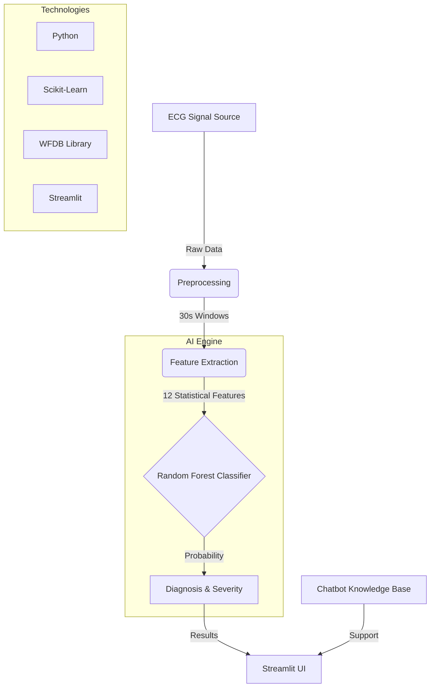

# Sleep Apnea Prediction from ECG Signals


An AI-powered medical diagnostic screening tool that detects Sleep Apnea patterns in ECG (Electrocardiogram) signals. Using advanced feature extraction and a Random Forest classifier, this system provides a non-invasive, quick, and reliable preliminary assessment of sleep apnea severity.

## 🏥 Project Overview

Sleep apnea is a serious sleep disorder where breathing repeatedly stops and starts. Traditional diagnosis (Polysomnography) is expensive and intrusive. This project leverages the correlation between heart rate variability (captured via ECG) and respiratory effort to provide a cost-effective screening solution.

### Key Features
- **ECG-Based Detection**: Analyze standard ECG signals for apnea patterns.
- **Machine Learning Analysis**: High-performance Random Forest model with **85.2% accuracy**.
- **Severity Classification**: Automatically categorizes results into Normal, Mild, Moderate, or Severe.
- **Interactive Dashboard**: Modern, glassmorphic UI built with Streamlit.
- **Smart Chatbot**: Integrated medical assistant for sleep apnea queries.
- **Signal Visualization**: Real-time plotting of ECG windows and detection events.

## 📐 System Architecture

The following diagram illustrates the data flow and system components:



## 📊 Model Performance

Our model was trained on the **PhysioNet Apnea-ECG Database** and achieved the following metrics:

| Metric | Value |
| :--- | :--- |
| **Accuracy** | 85.2% |
| **Precision** | 82.1% |
| **Recall** | 78.9% |
| **F1-Score** | 80.4% |
| **ROC-AUC** | 0.87 |

### Features Extracted (12 Total)
- **Time Domain**: Mean, Std Dev, Min, Max, Median, Percentiles (25th/75th).
- **Energy/Power**: Signal Energy, RMS (Root Mean Square).
- **Complexity**: Zero Crossing Rate.
- **HRV Indicators**: Std Dev of differences, Mean Absolute Difference.

## 🚀 Getting Started

### Prerequisites
- Python 3.8 or higher
- Git

### Installation

1. **Get the project**:

   **Option A — Clone via Git:**
   ```bash
   git clone git@github.com:Saravanan2005real/Sleep-apnea-prediction-using-ecg.git
   cd Sleep-apnea-prediction-using-ecg
   ```

   **Option B — Download ZIP:**
   Download the ZIP from GitHub, extract it, then open a terminal *inside* the extracted folder (e.g. `Sleep-apnea-prediction-using-ecg-main`). No `cd` to a subfolder is needed.

2. **Install dependencies**:
   ```bash
   pip install -r requirements.txt
   ```

3. **Run the application**:
   ```bash
   streamlit run app.py
   ```

## 📁 Project Structure

```text
├── app.py              # Main Streamlit Application
├── main.py             # Model Training & Evaluation Script
├── chatbot.py          # AI Assistant Module
├── best_sleep_apnea_model.pkl  # Pre-trained Random Forest Model
├── requirements.txt    # Project Dependencies
└── README.md           # Documentation
```

## 📜 Disclaimer

This system is intended for **preliminary screening and educational purposes only**. It is not a substitute for professional medical diagnosis, advice, or treatment. Always consult with a qualified healthcare provider for any medical concerns.

---
Developed by [Saravanan](https://github.com/Saravanan2005real)
